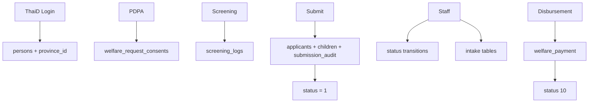

# Database

> See also: [README.md](./README.md) · [DATADICT.md](./DATADICT.md) · [ARCHITECTURE.md](./ARCHITECTURE.md) · [API.md](./API.md) · [WORKFLOW.md](./WORKFLOW.md)

คอลัมน์ครบทุกตาราง + ค่า lookup: **[DATADICT.md](./DATADICT.md)**

## Overview

| Attribute | Value |
|-----------|-------|
| **Engine** | PostgreSQL 16 |
| **Database name** | `case_service` |
| **ORM** | SQLAlchemy 2.x (async via `asyncpg`) |
| **Migrations** | `apps/service/case-service/alembic/` |
| **Models** | `apps/service/case-service/app/models/` |
| **Shared access** | case-service (owner), ocr-service (`ocr_results`), thaid-auth-service (`persons` + อ่าน `province_access_config`) |
| **Host port (dev)** | 5436 |
| **Alembic head** | `0079_case_help_beneficiaries` |
| **ตาราง (ไม่นับ `alembic_version`)** | 65 |

> Connection details ตั้งค่าใน `case-service/.env` — ไม่ระบุในเอกสารนี้

## แบ่งหน้าที่เอกสาร

| เอกสาร | เนื้อหา |
|--------|---------|
| **DATABASE.md** (ไฟล์นี้) | Engine, path, migration chain, ER, กลุ่มตาราง, กติกาสำคัญ |
| **[DATADICT.md](./DATADICT.md)** | Data dictionary — คอลัมน์ครบทุกตาราง เป็นตาราง อ่านง่าย |

## Migration Strategy

- Initial: `0001_initial_schema.py` (28 tables)
- Sequential ถึง `0060_case_data_edit_logs.py` (head เดียว — ไม่มี fork หลัง `0057`)
- Migration chain ล่าสุดช่วง mid: `0049` → … → `0057` → **`0058_approve_case_reject_resolved_at` → `0059_admin_province_access`** (สายหลัก) และ **`0058_case_data_edit_logs`** (สาย parallel จาก `0057`) → **`0060_case_data_edit_logs`** (merge head เดียว)
- `0060` → `0061`…`0067` (sequential) → fork `0068_member_evidences` / `0068_staff_users_audit` → **`0069_merge_0068_heads`** (merge) → `0070`…`0078` → **`0079_case_help_beneficiaries`** (head ปัจจุบัน)
- **DB ที่ stamp revision id เก่า:** ถ้า `0058_admin_province_access` → `UPDATE alembic_version SET version_num = '0059_admin_province_access'`; ถ้า `0058_case_data_edit_logs` → ไม่ต้อง stamp — รัน `alembic upgrade head` จะ apply `0058_approve` + `0059` แล้ว merge ที่ `0060` อัตโนมัติ
- Dev startup: `alembic upgrade head` (docker-compose.dev.yml หรือ `docker compose exec case-service alembic upgrade head`)
- Audit triggers: `created_at` / `updated_at` บนตารางหลัก — ฟังก์ชัน `set_updated_at_column()` + trigger `trg_set_updated_at_{table}` (ดู migration `0001`) — ครอบคลุม `applicants`, `dependency_loads`, `economic_infos`, `economic_income_sources`, `welfare_request_types`, `welfare_evidences`, `welfare_histories`, `welfare_histories_detail`, `persons`, `screening_logs`, `welfare_request_consents`

### Head 0065–0079 (สรุปสิ่งที่เพิ่มหลัง docs เดิม)

| Revision | เนื้อหา |
|----------|---------|
| `0065_occupation_types` | ตาราง `occupation_types` + FK ใน `economic_infos` / `household_members` |
| `0066_cover_document_batch` | ตาราง `cover_document_batch` + `article.batch_id` |
| `0067_article_approver_sdhsv_id` | `article.approver_sdhsv_id` |
| `0068_member_evidences` | `welfare_evidences.household_member_id` + `attachment_types` id=12 |
| `0068_staff_users_audit` | ตาราง `staff_users`, `security_audit_log` |
| `0069_merge_0068_heads` | merge สองสาย 0068 |
| `0070_case_diagnosis` | `case_diagnosis`, `case_diagnosis_edit_history` |
| `0071` + `0072` | `applicant_submission_audit` + `existing_case_detected_sources` |
| `0073_home_visit_fields` | `applicants.family_distress`, `address.nearby_landmark`, `economic_infos.housing_shelter` |
| `0074_case_handling_responsible_division` | `case_handling.responsible_division_id` |
| `0075_review_field_disable_ktb_corporate` | ปิด `review_field` id=45 |
| `0076_persons_province_id` | `persons.province_id` — submit/login gate อ่านคอลัมน์นี้ตรง ๆ |
| `0077_welfare_review_comment_citizen_confirmation` | `citizen_confirmed_at`, `citizen_confirmation_type` |
| `0078_attachment_cash_proof` | `attachment_types` id 13–15 (หลักฐานเงินสด/เช็ค) |
| `0079_case_help_beneficiaries` | ตาราง `case_help_beneficiaries` (**head**) |

## Entity Relationship Diagram

```mermaid
erDiagram
    persons ||--o{ applicants : "persons_id"
    persons ||--o{ screening_logs : "person_id"
    persons ||--o{ welfare_request_consents : "person_id"
    persons }o--o| province : "province_id"

    applicants ||--o{ address : "applicant_id"
    applicants ||--o{ economic_infos : "applicant_id"
    applicants ||--o{ dependency_loads : "applicant_id"
    applicants ||--o| welfare_histories : "applicant_id"
    applicants ||--o{ welfare_request_types : "applicant_id"
    applicants ||--o{ welfare_evidences : "applicant_id"
    applicants ||--o{ welfare_request_status : "applicant_id"
    applicants ||--o{ case_data_edit_logs : "applicant_id"
    applicants ||--o| case_handling : "applicant_id"
    applicants ||--o{ welfare_payment : "applicant_id"
    applicants ||--o{ approve_case : "applicant_id"
    applicants ||--o{ ocr_results : "applicant_id"
    applicants ||--o{ household_members : "applicant_id"
    applicants ||--o| applicant_submission_audit : "applicant_id"
    applicants ||--o| article : "applicant_id"
    applicants ||--o{ case_diagnosis : "applicant_id"
    applicants ||--o{ satisfaction_surveys : "applicant_id"
    applicants ||--o{ send_data : "applicant_id"

    household_members }o--|| prefix_type : "prefix_id"
    household_members }o--o| household_member_relation_types : "relation_to_applicant_id"
    household_members }o--o| occupation_types : "occupation_type_id"
    household_members ||--o{ welfare_evidences : "household_member_id"
    household_members ||--o{ case_help_beneficiaries : "household_member_id"

    economic_infos ||--o{ economic_income_sources : "economic_id"
    economic_infos }o--o| occupation_types : "occupation_type_id"

    welfare_histories ||--o{ welfare_histories_detail : "welfare_history_id"

    welfare_request_status }o--|| current_status : "current_status_id"
    case_data_edit_logs }o--|| current_status : "current_status_id_at_edit"
    welfare_request_status ||--o{ welfare_review_comment : "status_id"
    welfare_review_comment }o--|| review_field : "review_field_id"

    case_handling ||--o| case_regulation_choice : "case_handling_id"
    case_handling ||--o| case_payment : "case_handling_id"
    case_handling ||--o| case_ktb_corporate : "case_handling_id"
    case_handling ||--o| more_mso : "case_handling_id"
    case_handling ||--o{ case_help_beneficiaries : "case_handling_id"

    case_diagnosis ||--o{ case_diagnosis_edit_history : "diagnosis_id"

    cover_document_batch ||--o{ article : "batch_id"
    article ||--o{ approve_case : "article_id"

    welfare_dda_ref ||--o{ welfare_payment : "dda_ref_id"
    welfare_dda_ref ||--o{ file_payment : "welfare_dda_ref_id"

    admin_users ||--o{ province_access_config : "updated_by_admin_id"
    province ||--o| province_access_config : "province_id"
    province ||--o{ staff_users : "province_id"
```

## Table Catalog

รายละเอียดคอลัมน์ทุกตารางอยู่ที่ [DATADICT.md](./DATADICT.md) — ส่วนนี้สรุปกลุ่มและความสัมพันธ์

### Core Identity

| Table | Purpose | Source |
|-------|---------|--------|
| `persons` | บุคคล (CID unique) — ThaiD login เขียนที่นี่ รวม `province_id` สำหรับ submit gate | `app/models/person.py` |
| `applicants` | คำร้อง 1 แถวต่อครั้งที่ยื่น — FK `persons_id` | `app/models/applicant.py` |
| `applicant_submission_audit` | Snapshot Require KTB ตอนยื่น — **1:1** PK = `applicant_id` | `app/models/applicant_submission_audit.py` |

**Writers ของ `persons`:** case-service, thaid-auth-service (`person_persist.py`)

`require_ktb_reason`: `NEW_CASE` \| `NONE` \| `ACCOUNT_CHANGED` \| `PROVINCE_CHANGED`

### Address & Economics

| Table | Purpose |
|-------|---------|
| `address` | ที่อยู่ตาม `address_type` (รวม `nearby_landmark` จากเยี่ยมบ้าน) |
| `economic_infos` | รายได้, อาชีพ, ที่อยู่ (1:N ในโมเดล — ใช้ 1 แถวต่อเคส) |
| `economic_income_sources` | แหล่งรายได้ (composite PK) |
| `dependency_loads` | ผู้อยู่ในอุปการะ (composite PK) |
| `occupation_types` | Lookup อาชีพ (dropdown ผู้ยื่น + สมาชิกครัวเรือน) |

### Household Members

| Table | Purpose |
|-------|---------|
| `household_members` | สมาชิกครัวเรือน ปสค.๒ — UNIQUE(`applicant_id`,`seq`) |
| `household_member_relation_types` | ความสัมพันธ์กับผู้ประสบปัญหา |
| `welfare_evidences` | หลักฐานผู้ยื่น **หรือ** สมาชิก (`household_member_id` NULL = ผู้ยื่น) |

`physical_condition`: `normal` \| `disabled` \| `chronic_illness`

### Welfare Data

| Table | Purpose |
|-------|---------|
| `welfare_histories` / `welfare_histories_detail` | ประวัติรับสวัสดิการ |
| `welfare_request_types` | ประเภทคำร้อง (junction) — `request_in_kind_text`, `request_other_text` |
| `welfare_evidences` | metadata ไฟล์หลักฐาน (ไฟล์อยู่ filesystem) |

### Status & Review

| Table | Purpose |
|-------|---------|
| `welfare_request_status` | Append-only log — แถวล่าสุด = สถานะปัจจุบัน |
| `case_data_edit_logs` | Timeline นักสังคมฯ แก้ข้อมูล (แยกจาก status) |
| `review_field` | Master หัวข้อตีกลับแก้ |
| `welfare_review_comment` | Comment ต่อ field ต่อการตีกลับ 1 ครั้ง + ยืนยันประชาชนตอน resubmit |

`event_type` ของ edit log: `section_edit` \| `survey_edit`

`citizen_confirmation_type`: `unchanged_ok` \| `edited` (null จนกว่าประชาชน resubmit สำเร็จ)

**review_field ที่สำคัญ (สถานะปัจจุบัน):**

| id | name | label | step | is_active |
|----|------|-------|------|-----------|
| 18 | `household_members` | ข้อมูลสมาชิกในครัวเรือน | 1 | true |
| 31 | `requested_assistance_type` | ประเภทความช่วยเหลือที่ต้องการ | 3 | false (legacy) |
| 43 | `remarks` | หมายเหตุเพิ่มเติม | 0 | true |
| 45 | `doc_ktb_corporate` | รูปแบบฟอร์ม KTB Corporate Online | 4 | **false** (0075) |
| 46 | `requested_assistance_money` | ช่วยเหลือเป็นเงิน | 3 | true |
| 47 | `requested_assistance_in_kind` | ช่วยเหลือเป็นสิ่งของ | 3 | true |
| 48 | `requested_assistance_other` | ช่วยเหลือเรื่องอื่นๆ | 3 | true |

รายการครบ: [DATADICT.md § review_field](./DATADICT.md#review_field)

### Staff Intake

| Table | Page | Purpose |
|-------|------|---------|
| `case_handling` | Hub | 1:1 กับ applicant — รวม `responsible_division_id` |
| `case_regulation_choice` | 11 | เลือกระเบียบ + จำนวนเงิน |
| `case_help_beneficiaries` | 11 | ผู้รับความช่วยเหลือ (เงินเด็ก) — NULL member = ผู้ยื่น |
| `case_diagnosis` | 11 | คำวินิจฉัยหลายรายการ — 1 แถวต่อ applicant+owner_user_id |
| `case_diagnosis_edit_history` | 11 | ประวัติแก้คำวินิจฉัย |
| `case_payment` | 13 | วิธีรับเงินตอนรับเรื่อง |
| `case_ktb_corporate` | 20 | ฟอร์ม KTB Corporate |
| `announcement_regulations` | 11 | Master ระเบียบ/ประกาศ |
| `payment_method` | 13 | Master วิธีจ่าย 6 แถว |
| `more_mso` | — | ข้อมูล MSO เพิ่มเติม |

`case_diagnosis` ผูก `applicant_id` ตรง ๆ (ไม่ผ่าน `case_handling`) เพื่อเพิ่มคำวินิจฉัยได้ก่อนสร้าง hub — `UNIQUE(applicant_id, owner_user_id)`; `owner_user_id=0` = migrate จาก `case_regulation_choice.comment` (แก้ไม่ได้ถาวร)

`case_help_beneficiaries`: partial unique — สมาชิกคนละคนซ้ำในเคสเดียวกันไม่ได้; ผู้ยื่น (member NULL) ได้ 1 แถวต่อ handling

### Approval, Article & Disbursement

| Table | Purpose |
|-------|---------|
| `article` | เนื้อหาคำร้อง 1:1 กับ applicant — `batch_id` ผูกหนังสือนำส่ง |
| `cover_document_batch` | หัวหนังสือนำส่ง 1 ฉบับหลายเคส |
| `approve_case` | ประวัติอนุมัติ/PMJ reject |
| `welfare_dda_ref` | อ้างอิง DDA |
| `welfare_payment` | รอบจ่าย 037/038 |
| `file_payment` | ไฟล์แนบจ่าย (type 9=037, 10=038, 13–15=หลักฐานเงินสด/เช็ค) |

`approve_case.approve_status`: `true` = อนุมัติ, `false` = PMJ reject (`reject_reason` required เมื่อ false; `reject_resolved_at` set เมื่อนักสังคมฯ ดำเนินการต่อ)

**Rules** (`welfare_payment_flow.py`):
- 037: หนึ่งครั้งต่อ DDA (หลัง 0044 อนุญาตหลายรอบ 037 ได้)
- 038: หลายครั้งต่อรอบ
- `is_037_or_038`: `NULL` = รอบเปิด, `true` = 038, `false` = 037

### MSO, Eligibility, OCR, Geo, Lookups

| Group | Tables |
|-------|--------|
| MSO | `type_send`, `send_data`, `more_mso` |
| Eligibility | `screening_logs` (`hardship_status_ids` JSON), `welfare_request_consents` |
| OCR | `ocr_results` |
| Geo | `province`, `districts`, `sub_districts`, `postcode`, `sub_districts_postcode` |
| Lookups | `prefix_type`, `current_status`, `bank_name`, `request_types`, `household_member_relation_types`, `hardship_status_types`, `occupation_types`, … — seed ครบใน [DATADICT.md](./DATADICT.md#lookup--master-data) |
| Satisfaction | `satisfaction_surveys` (`system_usage` \| `aid_received`) |

### Admin, Staff & Province Access

| Table | Purpose |
|-------|---------|
| `admin_users` | บัญชี admin (CLI `app/admin_cli.py` เท่านั้น — bcrypt) |
| `province_access_config` | เปิด/ปิดบริการรายจังหวัด — **default deny** |
| `staff_users` | บัญชีเจ้าหน้าที่ SDSHV (HI-01) ผูกจังหวัด |
| `security_audit_log` | Audit ลบข้อมูล/ops สำคัญ (CR-05) |

> จังหวัดของประชาชนเก็บที่ `persons.province_id` (0076) — thaid-auth resolve ตอน login; submit gate อ่านคอลัมน์นี้ตรง ๆ ไม่เดินลูกโซ่ตำบล→อำเภออีก

## Services Without DB Schema

| Service | Storage |
|---------|---------|
| bff-vsmartcare | None |
| notification-service | In-memory |
| thaid-auth-service | In-memory sessions + เขียน `persons` + อ่าน `province_access_config` ตอน login (DB เดียวกับ case-service) |

## Data Lifecycle

## Maintenance Checklist

1. แก้ model ใน `apps/service/case-service/app/models/`
2. Export ใน `models/__init__.py`
3. สร้าง Alembic revision
4. อัปเดต [DATABASE.md](./DATABASE.md) (ภาพรวม/ER/head) + **[DATADICT.md](./DATADICT.md)** (คอลัมน์/lookup) + [WORKFLOW.md](./WORKFLOW.md)
5. ตรวจ ocr-service model ถ้า `ocr_results` เปลี่ยน

> Checklist ครบทุกประเภท requirement: [MAINTENANCE.md](../MAINTENANCE.md)
