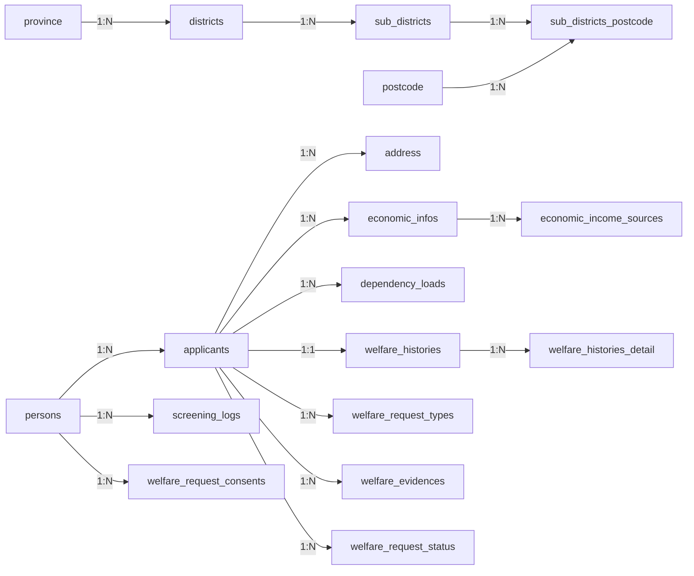

## case-service schema (ERD v2)

อ้างอิงจาก migration: `service/case-service/alembic/versions/0001_initial_schema.py` (Revision `0001_initial_schema`)

### Conventions

- **PK**: Primary Key
- **FK**: Foreign Key
- **NN**: NOT NULL
- **NULL**: Nullable
- **UQ**: Unique
- **IDX**: Index
- Type ใช้ตาม SQLAlchemy ใน migration (PostgreSQL)

---

## 1) Master / Lookup tables (10)

### `prefix_type`
- **Columns**
  - `id`: int, **PK**, NN, autoincrement
  - `name`: varchar(255), NN

### `marital_status_types`
- `id`: int, **PK**, NN
- `name`: varchar(255), NN

### `request_types`
- `id`: int, **PK**, NN
- `name`: varchar(255), NN

### `attachment_types`
- `id`: int, **PK**, NN
- `name`: varchar(255), NN

### `received_welfare_types`
- `id`: int, **PK**, NN
- `name`: varchar(255), NN

### `dependency_types`
- `id`: int, **PK**, NN
- `name`: varchar(255), NN

### `housing_types`
- `id`: int, **PK**, NN
- `name`: varchar(255), NN

### `income_source_types`
- `id`: int, **PK**, NN
- `name`: varchar(255), NN

### `address_type`
- `id`: int, **PK**, NN
- `name`: varchar(255), NN

### `current_status`
- `id`: int, **PK**, NN
- `name`: varchar(255), NN
- `description`: text, NULL

---

## 2) Geo / Address hierarchy (5)

### `province`
- `id`: int, **PK**, NN
- `code`: varchar(10), NULL, **IDX** (`ix_province_code`)
- `name`: varchar(255), NN

### `districts`
- `id`: int, **PK**, NN
- `name`: varchar(255), NN
- `province_id`: int, **FK → province.id**, NN, **IDX** (`ix_districts_province_id`)

### `sub_districts`
- `id`: int, **PK**, NN
- `name`: varchar(255), NN
- `district_id`: int, **FK → districts.id**, NN, **IDX** (`ix_sub_districts_district_id`)

### `postcode`
- `id`: int, **PK**, NN
- `name`: varchar(10), NN, **IDX** (`ix_postcode_name`)

### `sub_districts_postcode`
Bridge table (M:N) ระหว่าง `sub_districts` และ `postcode`
- `id`: int, **PK**, NN
- `sub_district_id`: int, **FK → sub_districts.id**, NN, **IDX** (`ix_sub_districts_postcode_sub_district_id`)
- `postcode_id`: int, **FK → postcode.id**, NN, **IDX** (`ix_sub_districts_postcode_postcode_id`)

---

## 3) Person / Applicant / Screening / Consent (4)

### `persons`
- `id`: int, **PK**, NN
- `prefix_id`: int, **FK → prefix_type.id**, NN
- `first_name`: varchar(255), NN
- `last_name`: varchar(255), NN
- `cid`: varchar(13), NN, **UQ** (`uq_persons_cid`), **IDX** (`ix_persons_cid`)
- `birth_date`: date, NN

### `applicants`
- `id`: int, **PK**, NN
- `persons_id`: int, **FK → persons.id**, NN, **IDX** (`ix_applicants_persons_id`)
- `requester_relation`: varchar(100), NULL
- `marital_status_id`: int, **FK → marital_status_types.id**, NN
- `mobile_phone`: varchar(20), NULL
- `home_phone`: varchar(20), NULL
- `fax_number`: varchar(20), NULL
- `email_address`: varchar(255), NULL
- `is_government_officer`: boolean, NN, server_default=false
- `problem_details`: text, NULL
- `bank_account_name`: varchar(255), NULL
- `bank_account_no`: varchar(50), NULL
- `time_count_process`: int, NULL
- `is_emergency`: boolean, NN, server_default=false
- `is_existing_case`: boolean, NN, server_default=false

### `screening_logs`
- `id`: int, **PK**, NN
- `person_id`: int, **FK → persons.id**, NN, **IDX** (`ix_screening_logs_person_id`)
- `criteria_version`: varchar(50), NULL
- `screening_result`: varchar(100), NULL
- `failure_reason_code`: varchar(100), NULL
- `screening_status`: boolean, NN, server_default=false
- `input_data_snapshot`: json, NULL
- `ip_address`: varchar(45), NULL
- `user_agent`: varchar(500), NULL

### `welfare_request_consents`
- `id`: int, **PK**, NN
- `person_id`: int, **FK → persons.id**, NN, **IDX** (`ix_welfare_request_consents_person_id`)
- `consent_type`: varchar(100), NULL
- `initial_pdpa_accepted`: boolean, NN, server_default=false
- `initial_terms_accepted`: boolean, NN, server_default=false
- `initial_warning_accepted`: boolean, NN, server_default=false
- `final_data_correct_accepted`: boolean, NN, server_default=false

---

## 4) Applicant dependent tables (Address/Economic/Dependency) (4)

### `address`
- `id`: int, **PK**, NN
- `sub_district_postcode_id`: int, **FK → sub_districts_postcode.id**, NN, **IDX** (`ix_address_sub_district_postcode_id`)
- `applicant_id`: int, **FK → applicants.id**, NN, **IDX** (`ix_address_applicant_id`)
- `address_type_id`: int, **FK → address_type.id**, NN
- `address_detail`: varchar(500), NULL
- `sub_lane_road`: varchar(255), NULL
- `mobile_phone`: varchar(20), NULL
- `latitude`: varchar(50), NULL
- `longitude`: varchar(50), NULL

### `economic_infos`
- `id`: int, **PK**, NN
- `applicant_id`: int, **FK → applicants.id**, NN, **IDX** (`ix_economic_infos_applicant_id`)
- `housing_types_id`: int, **FK → housing_types.id**, NULL
- `occupation`: varchar(255), NULL
- `monthly_income`: numeric(12,2), NULL
- `household_members`: int, NULL
- `family_occupation`: varchar(255), NULL

### `economic_income_sources`
Junction table (M:N) ระหว่าง `economic_infos` และ `income_source_types`
- **PK (composite)**: (`economic_id`, `income_source_type_id`)
- `economic_id`: int, **FK → economic_infos.id**, NN
- `income_source_type_id`: int, **FK → income_source_types.id**, NN
- `other_details`: varchar(500), NULL

### `dependency_loads`
Junction table (M:N) ระหว่าง `applicants` และ `dependency_types`
- **PK (composite)**: (`applicant_id`, `dependency_type_id`)
- `applicant_id`: int, **FK → applicants.id**, NN
- `dependency_type_id`: int, **FK → dependency_types.id**, NN
- `dependency_other_text`: varchar(500), NULL

---

## 5) Welfare domain (5)

### `welfare_histories`
1:1 กับ `applicants` (เพราะ PK = applicant_id)
- **PK**: `applicant_id`
- `applicant_id`: int, **PK**, **FK → applicants.id**, NN
- `received_count`: int, NULL
- `has_received_welfare`: boolean, NN, server_default=false
- `total_received_amount`: numeric(12,2), NULL

### `welfare_histories_detail`
Junction ระหว่าง `welfare_histories` และ `received_welfare_types`
- **PK (composite)**: (`welfare_history_id`, `received_welfare_type_id`)
- `welfare_history_id`: int, **FK → welfare_histories.applicant_id**, NN
- `received_welfare_type_id`: int, **FK → received_welfare_types.id**, NN
- `received_other`: varchar(500), NULL

### `welfare_request_types`
Junction ระหว่าง `applicants` และ `request_types`
- **PK (composite)**: (`applicant_id`, `request_type_id`)
- `applicant_id`: int, **FK → applicants.id**, NN
- `request_type_id`: int, **FK → request_types.id**, NN

### `welfare_evidences`
- `id`: int, **PK**, NN
- `attachment_type_id`: int, **FK → attachment_types.id**, NN
- `applicant_id`: int, **FK → applicants.id**, NN, **IDX** (`ix_welfare_evidences_applicant_id`)
- `file_path`: varchar(1024), NN

### `welfare_request_status`
- `id`: int, **PK**, NN
- `applicant_id`: int, **FK → applicants.id**, NN, **IDX** (`ix_welfare_request_status_applicant_id`)
- `current_status_id`: int, **FK → current_status.id**, NN
- `updated_at`: datetime, NN, server_default=now()
- `updated_by_firstname`: varchar(255), NULL
- `updated_by_lastname`: varchar(255), NULL
- `remarks`: text, NULL

---

## Relationship summary (cardinality)

